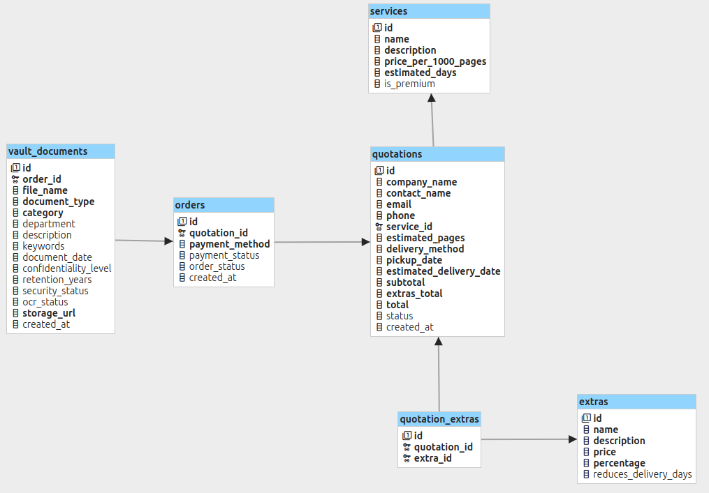

# Diccionario de datos

Descripción completa de las tablas de la base de datos, columnas, tipos y restricciones.

**Motor de base de datos:** PostgreSQL 14+  
**ORM:** SQLAlchemy 2.0 (modo declarativo)  
**Esquema:** `public` (por defecto)

---

## Diagrama de relaciones



---

## Tabla: `services`

Almacena los planes de servicio disponibles (Estándar y Premium).

| Columna                | Tipo          | Nulo | PK | Descripción                                      |
|------------------------|---------------|------|----|--------------------------------------------------|
| `id`                   | INTEGER       | No   | Sí | Identificador único autoincremental              |
| `name`                 | VARCHAR(100)  | No   | No | Nombre del plan                                  |
| `description`          | TEXT          | No   | No | Descripción detallada del plan                   |
| `price_per_1000_pages` | FLOAT         | No   | No | Precio por cada 1.000 páginas digitalizadas      |
| `estimated_days`       | INTEGER       | No   | No | Días hábiles estimados para completar el servicio|
| `is_premium`           | BOOLEAN       | No   | No | `true` si el plan incluye bóveda digital         |

**Registros iniciales (seeders):**

| id | name      | price_per_1000_pages | estimated_days | is_premium |
|----|-----------|----------------------|----------------|------------|
| 1  | Estándar  | 15.0                 | 10             | false      |
| 2  | Premium   | 25.0                 | 7              | true       |

---

## Tabla: `extras`

Almacena los servicios adicionales que se pueden incluir en una cotización.

| Columna                | Tipo          | Nulo | PK | Descripción                                                  |
|------------------------|---------------|------|----|--------------------------------------------------------------|
| `id`                   | INTEGER       | No   | Sí | Identificador único autoincremental                          |
| `name`                 | VARCHAR(100)  | No   | No | Nombre del servicio adicional                                |
| `description`          | TEXT          | No   | No | Descripción del servicio                                     |
| `price`                | FLOAT         | No   | No | Costo fijo en USD (0.0 si aplica porcentaje)                |
| `percentage`           | FLOAT         | No   | No | Porcentaje adicional sobre el subtotal (0.0 si aplica precio)|
| `reduces_delivery_days`| BOOLEAN       | No   | No | `true` si este extra reduce el plazo estimado de entrega    |

**Registros iniciales (seeders):**

| id | name                   | price | percentage | reduces_delivery_days |
|----|------------------------|-------|------------|-----------------------|
| 1  | Digitalización urgente | 0.0   | 30.0       | true                  |
| 2  | OCR simulado           | 50.0  | 0.0        | false                 |
| 3  | Entrega física         | 30.0  | 0.0        | false                 |

---

## Tabla: `quotations`

Almacena las cotizaciones generadas por los clientes.

| Columna                   | Tipo          | Nulo | PK | FK           | Descripción                                              |
|---------------------------|---------------|------|----|--------------|----------------------------------------------------------|
| `id`                      | INTEGER       | No   | Sí | —            | Identificador único autoincremental                      |
| `company_name`            | VARCHAR(200)  | No   | No | —            | Nombre de la empresa cliente                             |
| `contact_name`            | VARCHAR(200)  | No   | No | —            | Nombre del contacto                                      |
| `email`                   | VARCHAR(200)  | No   | No | —            | Email del contacto (validado por Pydantic)               |
| `phone`                   | VARCHAR(50)   | Sí   | No | —            | Teléfono de contacto                                     |
| `service_id`              | INTEGER       | No   | No | `services.id`| Plan de servicio elegido                                 |
| `estimated_pages`         | INTEGER       | No   | No | —            | Cantidad estimada de páginas a digitalizar               |
| `delivery_method`         | VARCHAR(100)  | No   | No | —            | Método de entrega: `digital` o `physical`                |
| `pickup_date`             | DATE          | No   | No | —            | Fecha acordada para recolección de documentos            |
| `estimated_delivery_date` | DATE          | Sí   | No | —            | Fecha estimada de entrega (calculada por el backend)     |
| `subtotal`                | FLOAT         | No   | No | —            | Subtotal antes de extras                                 |
| `extras_total`            | FLOAT         | No   | No | —            | Total de servicios adicionales                           |
| `total`                   | FLOAT         | No   | No | —            | Total final de la cotización                             |
| `status`                  | VARCHAR(50)   | No   | No | —            | Estado de la cotización (ver valores abajo)              |
| `created_at`              | DATETIME      | No   | No | —            | Fecha y hora de creación                                 |

**Valores de `status`:**

| Valor                | Descripción                              |
|----------------------|------------------------------------------|
| `quotation_generated`| Cotización generada, pendiente de compra |

---

## Tabla: `quotation_extras`

Tabla de unión N:M entre cotizaciones y extras.

| Columna        | Tipo    | Nulo | PK | FK               | Descripción                     |
|----------------|---------|------|----|------------------|---------------------------------|
| `id`           | INTEGER | No   | Sí | —                | Identificador único             |
| `quotation_id` | INTEGER | No   | No | `quotations.id`  | Referencia a la cotización      |
| `extra_id`     | INTEGER | No   | No | `extras.id`      | Referencia al extra seleccionado|

---

## Tabla: `orders`

Almacena las órdenes de servicio generadas a partir de cotizaciones confirmadas.

| Columna          | Tipo        | Nulo | PK | FK               | Descripción                                      |
|------------------|-------------|------|----|------------------|--------------------------------------------------|
| `id`             | INTEGER     | No   | Sí | —                | Identificador único autoincremental              |
| `quotation_id`   | INTEGER     | No   | No | `quotations.id`  | Cotización origen de la orden                    |
| `payment_method` | VARCHAR(50) | No   | No | —                | Método de pago seleccionado (ver valores abajo)  |
| `payment_status` | VARCHAR(50) | No   | No | —                | Estado del pago (ver valores abajo)              |
| `order_status`   | VARCHAR(50) | No   | No | —                | Estado de la orden (ver valores abajo)           |
| `created_at`     | DATETIME    | No   | No | —                | Fecha y hora de creación de la orden             |

**Valores de `payment_method`:**

| Valor              | Descripción                    |
|--------------------|--------------------------------|
| `credit_card`      | Tarjeta de crédito/débito      |
| `bank_transfer`    | Transferencia bancaria         |
| `cash_on_delivery` | Pago contra entrega            |
| `purchase_order`   | Orden de compra empresarial    |

**Valores de `payment_status`:**

| Valor              | Descripción                             |
|--------------------|-----------------------------------------|
| `payment_confirmed`| Pago confirmado (estado inicial)        |
| `refund_pending`   | Devolución pendiente (tras cancelación) |

**Valores de `order_status`:**

| Valor                  | Etapa | Descripción                                      |
|------------------------|-------|--------------------------------------------------|
| `pickup_scheduled`     | 1     | Servicio programado, pendiente de inicio         |
| `documents_collected`  | 2     | Documentos físicos recibidos                     |
| `digitizing`           | 3     | Proceso de escaneo en curso                      |
| `quality_review`       | 4     | Verificación de calidad de archivos              |
| `preparing_delivery`   | 5     | Archivos preparados para envío                   |
| `delivered`            | 6     | Archivos enviados al cliente                     |
| `available_in_vault`   | 7     | Disponible en bóveda digital (solo Premium)      |
| `cancelled`            | —     | Orden cancelada (solo desde `pickup_scheduled`)  |

---

## Tabla: `vault_documents`

Almacena los documentos digitalizados en la bóveda digital, exclusiva para clientes Premium.

| Columna                | Tipo         | Nulo | PK | FK          | Descripción                                           |
|------------------------|--------------|------|----|-------------|-------------------------------------------------------|
| `id`                   | INTEGER      | No   | Sí | —           | Identificador único autoincremental                   |
| `order_id`             | INTEGER      | No   | No | `orders.id` | Orden a la que pertenece el documento                 |
| `file_name`            | VARCHAR(255) | No   | No | —           | Nombre del archivo digitalizado                       |
| `document_type`        | VARCHAR(100) | No   | No | —           | Tipo de documento (Contrato, Factura, etc.)           |
| `category`             | VARCHAR(100) | No   | No | —           | Categoría documental                                  |
| `department`           | VARCHAR(100) | Sí   | No | —           | Área o departamento responsable del documento         |
| `description`          | TEXT         | Sí   | No | —           | Descripción libre del documento                       |
| `keywords`             | TEXT         | Sí   | No | —           | Palabras clave para búsqueda, separadas por comas     |
| `document_date`        | DATE         | Sí   | No | —           | Fecha del documento original                         |
| `confidentiality_level`| VARCHAR(50)  | No   | No | —           | Nivel de confidencialidad (ver valores abajo)         |
| `retention_years`      | INTEGER      | No   | No | —           | Años que debe conservarse el documento               |
| `security_status`      | VARCHAR(50)  | No   | No | —           | Estado de seguridad del archivo (ver valores abajo)   |
| `ocr_status`           | VARCHAR(50)  | No   | No | —           | Estado del proceso OCR (ver valores abajo)            |
| `storage_url`          | VARCHAR(500) | No   | No | —           | URL de acceso al archivo en el sistema de almacenamiento|
| `created_at`           | DATETIME     | No   | No | —           | Fecha y hora de registro en la bóveda                |

**Valores de `confidentiality_level`:**

| Valor          | Descripción                                    |
|----------------|------------------------------------------------|
| `public`       | Sin restricciones de acceso                    |
| `internal`     | Uso interno de la empresa                      |
| `confidential` | Acceso restringido a personal autorizado       |
| `secret`       | Máxima restricción de acceso                   |

**Valores de `security_status`:**

| Valor                | Descripción                               |
|----------------------|-------------------------------------------|
| `encrypted`          | Archivo cifrado en reposo                 |
| `pending_encryption` | Cifrado pendiente de aplicar              |

**Valores de `ocr_status`:**

| Valor        | Descripción                                       |
|--------------|---------------------------------------------------|
| `pending`    | OCR aún no iniciado                               |
| `processing` | OCR en proceso                                    |
| `completed`  | OCR finalizado con éxito                          |
| `failed`     | OCR falló; requiere revisión manual               |

---

## Índices y restricciones

SQLAlchemy no define índices adicionales en este proyecto más allá de las claves primarias y foráneas. Para optimizar consultas frecuentes en producción, considerar:

```sql
-- Búsquedas de órdenes por estado
CREATE INDEX idx_orders_status ON orders (order_status);

-- Búsquedas de documentos por orden
CREATE INDEX idx_vault_order ON vault_documents (order_id);

-- Búsquedas de documentos por tipo o categoría
CREATE INDEX idx_vault_type_category ON vault_documents (document_type, category);
```
